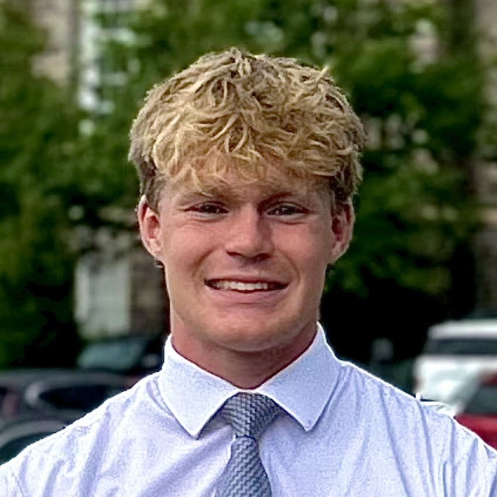

This website serves as both an online resume and a comprehensive project portfolio. It is designed to showcase my professional experience, skills, and accomplishments in a dynamic and easily accessible format.

Navigate to my project portfolio [here](./project-portfolio-home.html) or keep on reading below to learn more about me.

# Who am I?

* * *

My name is Austin. I love to learn and am constantly trying out new things. My continual yearn for knowledge, and being willing to seek it out, has cultivated my passion for self-advacement in all aspects of my life. Whether it is studying for a difficult class, learning to juggle on a unicycle, doing a backflip, or anything else, I am driven to learn. 

In fact, that's pretty much the motivation behind creating this website, I thought it would be cool to build my own website and so I decided to learn how.
<!-- Add in a link to a fun section about my hobbies, interests, and other stuff. -->

# Resume

* * *

Resume content was last updated on January 28, 2025.

    
Click to Expand

    
# will this work?
    
    > trying to do  block quote with html
    >
    > did it work?
    

### EDUCATION

> **B.S. Mechanical Engineering**
> _Brigham Young University_, Provo, UT
> April 2027
> * Minor in Computer Science
> * GPA: 3.94

### ENGINEERING RELATED EXPERIENCE

> See my [project portfolio](./project-portfolio-home.html)

### HARD SKILLS

| Skill | Hours | Related Projects |
|:-------------|:----------|:--------|
| CAD (Onshape) | 135 | CAD Portfolio |
| Python | 360 | CS111, Fourier Series, Comp. Methods |
| C++ | 360 | CS235, CS 236 |
| Julia | 80 | Aerodynamic Analysis and Optimization |
| Composites (Carbon Fiber) | 15 | Water Ballast, ALC Payload |
| 3D Printing | 10 |  Water Ballast, ALC Payload |
| Laser Cutting | 10 | G Lvl Rocket, H Lvl Rocket |
| Circuit Design | 10 | FEMTOSAT, ALC Payload, Light Following Robot |
| Portuguese | 2 Years | Volunteer Experience |
| Spanish | 40 | Volunteer Experience |

### OTHER WORK EXPERIENCE

- **Youth Summer Camp Counselor**
    - _FSY_, Arizona, California, Utah
    - May 2024 - July 2024
    - Description
- **Sales Representative**
    - _Pure Energy_, Houston, TX
    - July 2023 - September 2023
    - Decription
- **Cook**
    - _Zaxby's_, Houston, TX
    - June 2020 - June 2021
    - Description
- **Soccer Referee**
    - _South Texas Soccer Referees_, Houston, TX
    - May 2019 - June 2021
    - Description

### VOLUNTEER SERVICE

**Full-Time Volunteer**
_The Church of Jesus Christ of Latter-day Saints_, Vitória, ES, Brazil
July 2021 - July 2023
* Met, conversed with, and taught over 50 individuals and families on a weekly basis
* Organized and led 10+ workshops on goal setting, relationship building, and leadership skills for
groups of 20-30 full-time volunteers
* Supervised as Financial Administrator for 8 months managing 30+ houses and apartments
* Taught English as a second language to 5-8 community members weekl

### OTHER

* Proficient pianist, organist, and violinist
* High School Varsity Soccer Captain