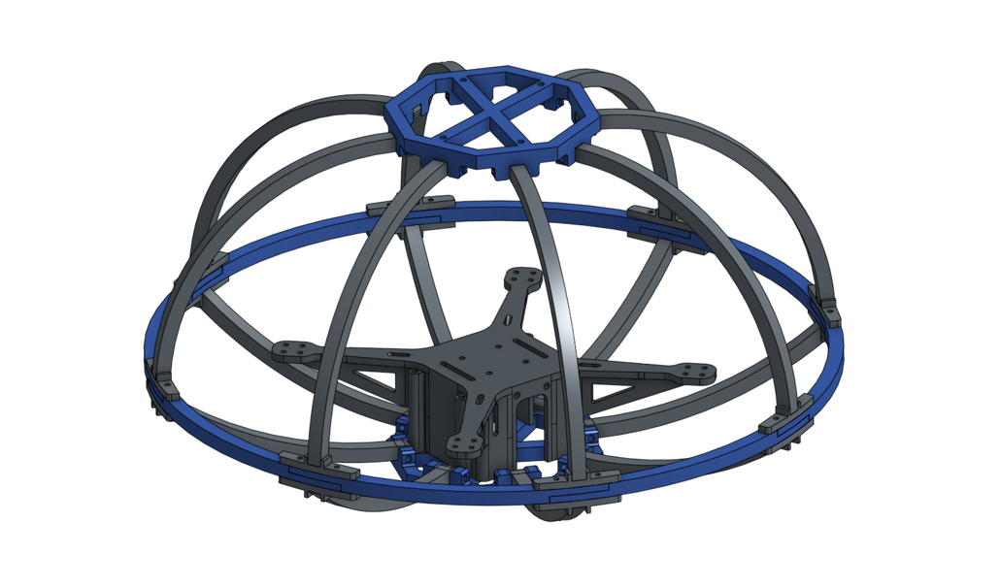

---
hide:
  - navigation
#   - toc
---

# Home

This website serves as an online resume and comprehensive [**project portfolio**](project-portfolio/complete-project-portfolio.md). It is designed to showcase my professional experience, skills, and engineering accomplishments in an easily accessible format.

***
## Bio

{ align=left width=25% style="border-radius: 50%; object-fit: cover;" }

**Austin McGlashan** 

After graduating high school, I lived in Brazil for two years as a religious volunteer. I began studying Mechanical Engineering at Brigham Young University in 2023. I love to learn and am driven by an insatiable curiosity of the world around me. Aside from my academic endeavors, I enjoy many other interests including sports and music.

[:simple-github:](https://github.com/austin006)&emsp;
[:fontawesome-brands-linkedin:](https://www.linkedin.com/in/austin-mcglashan-006/)&emsp;
[:simple-youtube:](https://www.youtube.com/@austinmcglashan006)

 

***

## Education

-   __**:fontawesome-solid-graduation-cap: BS Mechanical Engineering**__
    *Minor in Computer Science*

    [***Brigham Young University***](https://www.youtube.com/watch?v=qohZGTqhXmg) • *Expected Graduation: April 2028*

    A rigorous, ABET-accredited program focused on core engineering principles, computational analysis, and hands-on design projects.

    !!! abstract "Key Coursework & Specializations"
        - **ME Core**: Thermodynamics, Fluid Mechanics, Heat Transfer, Machine Design, Control Systems
        - **CS Minor**: Data Structures, Algorithms, Object-Oriented Programming, Numerical Methods

***

## Experience

-   __**:material-quadcopter: Quadrotor Systems & AI Integration Engineer**__

    [***BYU MAGICC Lab***](https://magicc.byu.edu/) • *May 2025 - Present*

    !!! success "Key Achievements"
        - Architected and fabricated a custom 3D-printed quadrotor for autonomous systems research.
        - Developed multi-agent simulations and integrated an AI agent with ROS2, enabling intuitive, natural-language flight commands.

    !!! info "Technologies Used"
        `Python` `C++` `ROS2` `Gazebo` `Onshape` `AI Agents` `NLP`

-   __**:material-rocket-launch: Payload Subsystem Engineer**__

    [***BYU Rocketry (EHPT)***](https://www.youtube.com/watch?v=11XYRcnl5vY&t) • *Sep 2024 - April 2025*

    !!! success "Key Achievements"
        - Engineered a novel water ballast subsystem to eject 3 kg of water mid-flight for a high-power competition rocket.
        - Contributed to the team's successful entry in the **FAR-OUT** collegiate rocketry competition.

    !!! info "Technologies Used"
        `Onshape` `Systems Integration` `Avionics` `Structural Analysis`

-   __**:fontawesome-solid-plane: Aerodynamics Research Assistant**__

    [***BYU FLOW Lab***](https://flow.byu.edu/) • *Oct 2023 - April 2024*

    !!! success "Key Achievements"
        - Conducted a computational research project focused on airframe optimization.
        - Executed aerodynamic analysis using the vortex lattice method and implemented nonlinear optimization algorithms in Julia.

    !!! info "Technologies Used"
        `Julia` `Paraview` `NumPy` `SciPy` `Vortex Lattice Method` `Aerodynamic Analysis`

-   __**:material-school: NASA Aerospace Scholar**__

    [***NASA Johnson Space Center***](https://www.nasa.gov/learning-resources/high-school-aerospace-scholars/) • *Oct 2019 - April 2020*

    !!! success "Key Achievements"
        - Selected for an intensive STEM program mentored by NASA engineers. 
        - Collaborated with peers to tackle complex engineering design challenges.

    !!! info "Focus Areas"
        `Mission Planning` `Systems Engineering` `Collaborative Design` `STEM`

***

## Skills
| Category | Tools & Specifics | Related Projects |
|:---|:---|:---|
| **Programming & Software** | Python, C++, Julia, Git/GitHub, Docker, Linux/Ubuntu | [CS 111](https://github.com/austin006/CS_111.git), [CS 236](https://github.com/austin006/CS_236.git), [Solving ODEs](https://github.com/austin006/Solving_ODEs_Numerically.git), [Fourier Series Visualization](project-portfolio/projects/2025/fourier.md), [Aerodynamic Analysis and Optimization](project-portfolio/projects/2024/aerodynamics.md) |
| **AI Deployment** | LangChain, LangGraph, Hugging Face, Ollama | [3D Printed Quadrotor](project-portfolio/projects/2025/quadrotor.md) |
| **Robotics** | ROS 2, Gazebo, PX4 Flight Controllers | [3D Printed Quadrotor](project-portfolio/projects/2025/quadrotor.md), [Light Following Robot](project-portfolio/projects/2025/ecen301.md) |
| **Mechanical Design & Fabrication** | CAD (Onshape), 3D Printing, Laser Cutting, Composites (Carbon Fiber) | [CAD Portfolio](project-portfolio/projects/2025/cad.md), [Water Ballast](project-portfolio/projects/2025/water-ballast.md), [ALC Payload](project-portfolio/projects/2024/payload-electronics.md), [3D Printed Quadrotor](project-portfolio/projects/2025/quadrotor.md), [G Lvl Rocket](project-portfolio/projects/2023/G-rocket.md), [H Lvl Rocket](project-portfolio/projects/2024/H-rocket.md) |
| **Electronics** | Circuit Design, Soldering, Arduino, Raspberry Pi, Jetson Nano | [FEMTOSAT](project-portfolio/projects/2023/femtosat.md), [ALC Payload](project-portfolio/projects/2024/payload-electronics.md), [Light Following Robot](project-portfolio/projects/2025/ecen301.md) |
| **Languages** | Portuguese, Spanish | [Missionary Program](https://newsroom.churchofjesuschrist.org/topic/missionary-program) |

***

## Key Projects

-   :material-quadcopter:{ .lg .middle } __3D Printed Quadrotors__

    ---

    Design and creation of multiple 3D printed quadrotors to fly in formation using ROS2

    { height=50% }

    [:octicons-arrow-right-24: Learn more](project-portfolio/projects/2025/quadrotor.md)

-   :material-printer-3d:{ .lg .middle } __Computer Aided Design (CAD)__

    ---

    Use of engineering graphics to efficiently develop ideas into engineered designs

    { width= 100% }
    
    [:octicons-arrow-right-24: Learn more](project-portfolio/projects/2025/cad.md)
    

-   :material-water:{ .lg .middle } __Rocket Water Ballast System__

    ---

    A post-apogee water ejection system for a high altitude rocket with hybrid motor

    { width= 100% }
    
    [:octicons-arrow-right-24: Learn more](project-portfolio/projects/2025/water-ballast.md)
    

-   :fontawesome-solid-plane:{ .lg .middle } __Aerodynamic Analysis & Optimization__

    ---

    Optimization of a wing airframe configuration using Julia packages

    { width= 100% }
    
    [:octicons-arrow-right-24: Learn more](project-portfolio/projects/2024/aerodynamics.md)
    

///caption
[:material-button-cursor: Explore my complete project portfolio](./project-portfolio/complete-project-portfolio.md){ .md-button .md-button--primary }
///