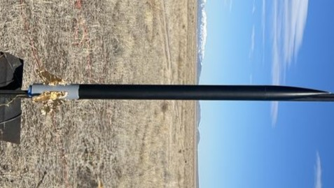

---
hide:
  - navigation
#   - toc
---

# Home

This website serves as an online resume and comprehensive [**project portfolio**](project-portfolio/complete-project-portfolio.md). It is designed to showcase my professional experience, skills, and engineering accomplishments in an easily accessible format.

!!! quote "Words  From My Professor"

    "Without a portfolio, how else are you going to know I can do the things I say I can do?    
    Telling me says almost nothing, while showing me says almost everything. It’s that simple."[^1]

[^1]: Mattson, Chris. “How to Get the Job - Part 1.” The BYU Design Review, 17 Sep. 2019, https://www.designreview.byu.edu/collections/how-to-get-the-job.

***
## Bio

{ align=left width=25% style="border-radius: 50%; object-fit: cover;" }

**Austin McGlashan** 

After graduating high school, I lived in Brazil for two years as a religious volunteer. I began studying Mechanical Engineering at Brigham Young University in 2023. I love to learn and am driven by an insatiable curiosity of the world around me. Aside from my academic endeavors, I enjoy many other interests including sports and music.

[:simple-github:](https://github.com/austin006)&emsp;
[:fontawesome-brands-linkedin:](https://www.linkedin.com/in/austin-mcglashan-006/)&emsp;
[:simple-youtube:](https://www.youtube.com/@austinmcglashan006)

 

<!-- I'm Austin, and at my core, I'm driven by an insatiable curiosity and a profound commitment to continuous learning. This fundamental desire to acquire new knowledge and skills propels me in all endeavors—whether it's excelling in challenging coursework, mastering the coordination of juggling on a unicycle, or executing a backflip. This website itself is a direct outcome of that passion; I wanted to build my own online space, viewed it as a compelling learning opportunity, and enthusiastically immersed myself in the process of bringing it to life. -->

***
## Education

:fontawesome-solid-graduation-cap: **BS Mechanical Engineering**; Minor in Computer Science

&emsp;&emsp;Brigham Young University

&emsp;&emsp;*Graduation: April 2028*

***

## Experience

**Quadrotor Systems & AI Integration Engineer** – BYU Multiple AGent Intelligent Coordination and Control Lab (MAGICC Lab)
May 2025 - Present

* Designed and built a 3D-printed quadrotor along with multi-agent simulations
* Integrated an AI agent with ROS2 for natural-language quadrotor control

**Payload Subsystem Engineer** – BYU Rocketry Experimental High Power Team (EHPT)
Sep 2024 - April 2025

* Engineered a water ballast to eject 3 kg mid-flight using <1.5 kg system.
* Integrated payload with rocket structure and avionics to compete in in FAR-OUT competition

**FLOW Lab Undergraduate Student** – BYU FLight, Optimization, and Wind Laboratory (FLOW Lab)
Oct 2023 – April 2024
    
* Performed aerodynamic analysis and designed a simple elliptical airframe through vortex lattice
method and nonlinear optimization algorithms in a coding-based research project

**NASA Aerospace Scholar** – NASA High School Aerospace Scholars Program Johnson Space Center
Oct 2019 – April 2020

* Engaged in a STEM learning experience led by NASA engineers, scientists, and astronauts
* Completed hands-on design challenges and engineering activities for Moon and Mars missions

***
## Key Projects

-   :material-quadcopter:{ .lg .middle } __3D Printed Quadrotors__

    ---

    Design and creation of multiple 3D printed quadrotors to fly in formation using ROS2

    { height=50% }

    [:octicons-arrow-right-24: Learn more](project-portfolio/projects/2025/quadrotor.md)

-   :material-printer-3d:{ .lg .middle } __Computer Aided Design (CAD)__

    ---

    Use of engineering graphics to efficiently develop ideas into engineered designs

    { width= 100% }
    
    [:octicons-arrow-right-24: Learn more](project-portfolio/projects/2025/cad.md)
    

-   :material-water:{ .lg .middle } __Rocket Water Ballast System__

    ---

    A post-apogee water ejection system for a high altitude rocket with hybrid motor

    { width= 100% }
    
    [:octicons-arrow-right-24: Learn more](project-portfolio/projects/2025/water-ballast.md)
    

-   :material-airplane:{ .lg .middle } __Aerodynamic Analysis & Optimization__

    ---

    Optimization of a wing airframe configuration using Julia packages

    { width= 100% }
    
    [:octicons-arrow-right-24: Learn more](project-portfolio/projects/2024/aerodynamics.md)
    

-   :material-rocket:{ .lg .middle } __Rocket with H Level Motor__

    ---

    Launch and recovery of H impulse motor rocket to recieve level 1 certification

    { height= 100% }
    /// caption
    [:octicons-arrow-right-24: Learn more](project-portfolio/projects/2024/H-rocket.md)
    ///
    

///caption
[:material-button-cursor: Explore my complete project portfolio](./project-portfolio/complete-project-portfolio.md){ .md-button .md-button--primary }
///

***
## Skills
| Skill | Hours | Related Projects |
|:-------------|:----------|:--------|
| Docker | 50 | ROS 2, Ubuntu Environments |
| ROS 2 | 300 | [Quadrotors](project-portfolio/projects/2025/quadrotor.md) |
| Python | 360 | [CS 111](https://github.com/austin006/CS_111.git), [Fourier Series Visualization](project-portfolio/projects/2025/fourier.md), [Solving ODEs](https://github.com/austin006/Solving_ODEs_Numerically.git) |
| C++ | 360 | CS 235, [CS 236](https://github.com/austin006/CS_236.git) |
| Julia | 80 | [Aerodynamic Analysis and Optimization](project-portfolio/projects/2024/aerodynamics.md) |
| CAD | 250 | [CAD Portfolio](project-portfolio/projects/2025/cad.md), 3D Printing |
| 3D Printing | 30 | [Quadrotors](project-portfolio/projects/2025/quadrotor.md), [Water Ballast](project-portfolio/projects/2025/water-ballast.md), [ALC Payload](project-portfolio/projects/2024/payload-electronics.md) |
| Composites (Carbon Fiber) | 15 | [Water Ballast](project-portfolio/projects/2025/water-ballast.md), [ALC Payload](project-portfolio/projects/2024/payload-electronics.md) |
| Laser Cutting | 10 | [G Lvl Rocket](project-portfolio/projects/2023/G-rocket.md), [H Lvl Rocket](project-portfolio/projects/2024/H-rocket.md) |
| Circuit Design | 30 | [FEMTOSAT](project-portfolio/projects/2023/femtosat.md), [ALC Payload](project-portfolio/projects/2024/payload-electronics.md), [Light Following Robot](project-portfolio/projects/2025/ecen301.md) |
| Portuguese | 2 Years | Volunteer |
| Spanish | 40 | Volunteer |