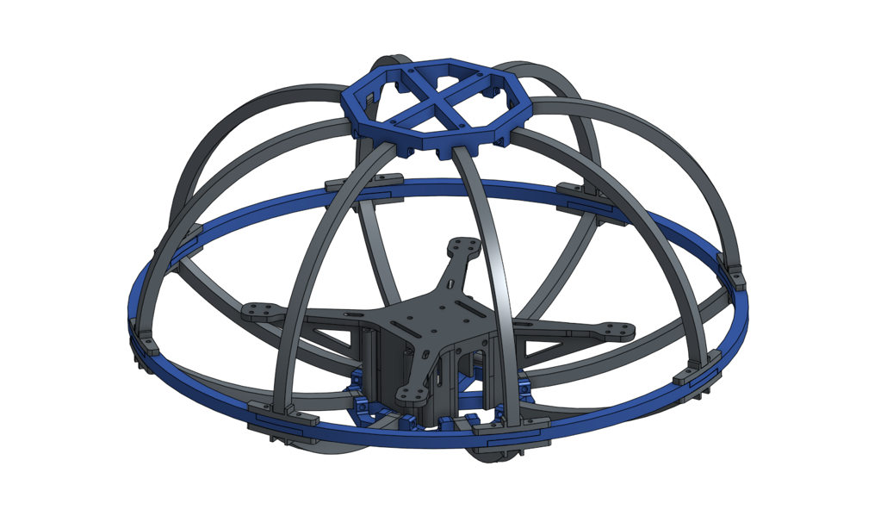
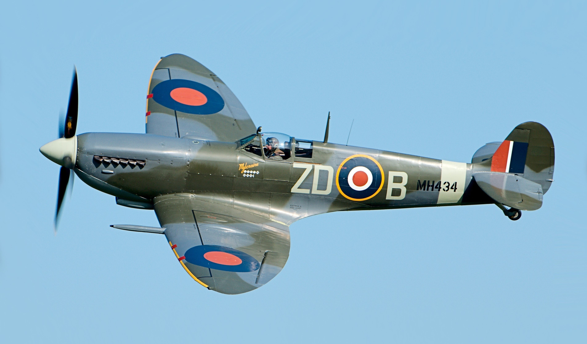
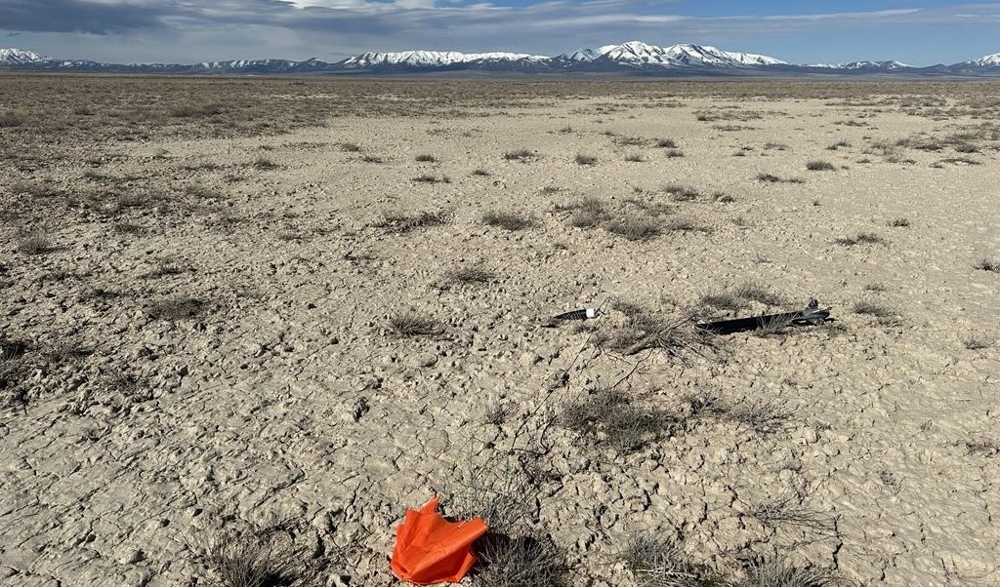

---
hide:
  - navigation
  - toc
---

# Complete Project Portfolio

* * *

Welcome to my portfolio. This collection features engineering projects completed during my undergraduate studies, each demonstrating the progression of my technical knowledge, analytical skills, and professional development. Selecting a project will provide additional details and outcomes.

=== "Key Projects"

    

    
    -   :material-quadcopter:{ .lg .middle } __3D Printed Quadrotors__
    
        ---
    
        Design and creation of multiple 3D printed quadrotors to fly in formation using ROS2
    
        { height=50% }
    
        [:octicons-arrow-right-24: Learn more](./projects/2025/quadrotor.md)
    
    -   :material-printer-3d:{ .lg .middle } __Computer Aided Design (CAD)__
    
        ---
    
        Use of engineering graphics to efficiently develop ideas into engineered designs
    
        { width= 100% }
        
        [:octicons-arrow-right-24: Learn more](./projects/2025/cad.md)
        
    
    -   :material-water:{ .lg .middle } __Rocket Water Ballast System__
    
        ---
    
        A post-apogee water ejection system for a high altitude rocket with hybrid motor
    
        { width= 100% }
        
        [:octicons-arrow-right-24: Learn more](./projects/2025/water-ballast.md)
        
    
    -   :fontawesome-solid-plane:{ .lg .middle } __Aerodynamic Analysis & Optimization__
    
        ---
    
        Optimization of a wing airframe configuration using Julia packages
    
        { width= 100% }
        
        [:octicons-arrow-right-24: Learn more](./projects/2024/aerodynamics.md)

    -   :material-rocket:{ .lg .middle } __Rocket with H Level Motor__

        ---

        Launch and recovery of H impulse motor rocket to recieve level 1 certification

        { height= 100% }

        [:octicons-arrow-right-24: Learn more](./projects/2024/H-rocket.md)
        
        
    

=== "Full List"

    <!-- Hovering over a title will show a brief description;  -->

    The projects are arranged in reverse chronological order, with the most recent appearing first. Starred projects (⭐) identify major milestones that reflect greater depth of work and impact.

    ## **2025**

    | Name    | Completion | Hours |
    |:--------|:---------- |:------|
    | [:star: **3D Printed Quadrotors**](projects/2025/quadrotor.md)  | August 2025 | 300 |
    | [Personal Website](projects/2025/website.md)                    | August 2025 | 40 |
    | [Rocket Water Ballast System](projects/2025/water-ballast.md)   | May 2025    | 50 |
    | [:star: **CAD Portfolio**](projects/2025/cad.md)                | April 2025  | 150|
    | [Light Following Robot](projects/2025/ecen301.md)               | April 2025  | 25 |
    | [Compiler From Scratch](projects/2025/compiler.md)              | April 2025  | 50 |
    | [ALC Rocket](projects/2025/alc.md)                              | April 2025  | 20 |

    ## **2024**

    | Name    | Completion | Hours |
    |:--------|:---------- |:------|
    | [Gear Motion](projects/2024/gear-motion.md)                                       | December 2024| 5  |
    | [Motion Analysis of Backflips](projects/2024/backflips.md)                        | November 2024| 15 |
    | [Static Friction Coefficient Calculator](projects/2024/friction.md)               | April 2024   | 15 |
    | [:star: **Aerodynamic Analysis and Optimization**](projects/2024/aerodynamics.md) | April 2024   | 90 |
    | [Rocket Payload Electronics](projects/2024/payload-electronics.md)                | April 2024   | 35 |
    | [:star: **H Level Rocket**](projects/2024/H-rocket.md)                            | April 2024   | 30 |
    | [Distance Triangulation](projects/2024/triangulation.md)                          | February 2024| 15 |

    ## **2023**

    | Name    | Completion | Hours |
    |:--------|:---------- |:------|
    | [:star: **G Level Rocket**](projects/2023/G-rocket.md) | December 2023 | 30 |
    | [FemtoSat](projects/2023/femtosat.md)                  | December 2023 | 20 |
    | [RC Plane](projects/2023/rc-plane.md)                  | December 2023 | 20 |

    ## **Pre-University**

    | Name    | Completion | Hours |
    |:--------|:---------- |:------|
    | [NASA Engineering Challenge](projects/pre-uni/nasa.md)             | April 2020    | 30  |
    | [Pull Up Bar](projects//pre-uni/pull-up.md)                        | December 2019 | 5   |
    | [Eagle Scout Project - Grave Indexing](projects/pre-uni/eagle.md)  | April 2017    | 129 | 