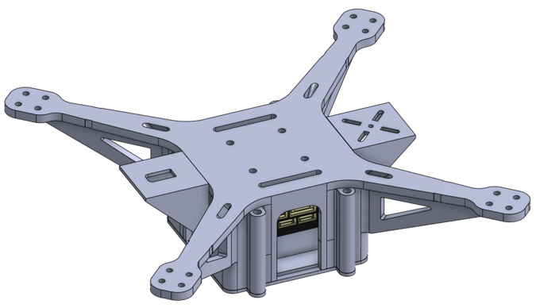
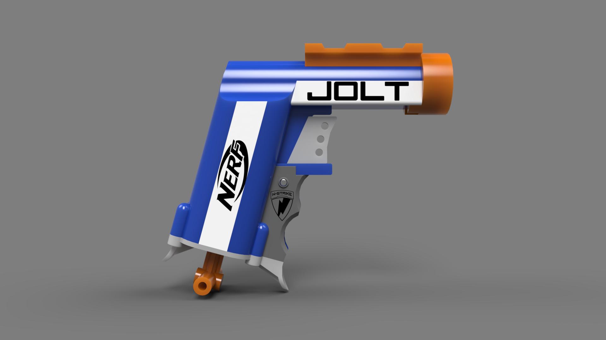
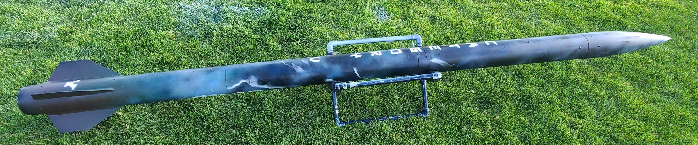
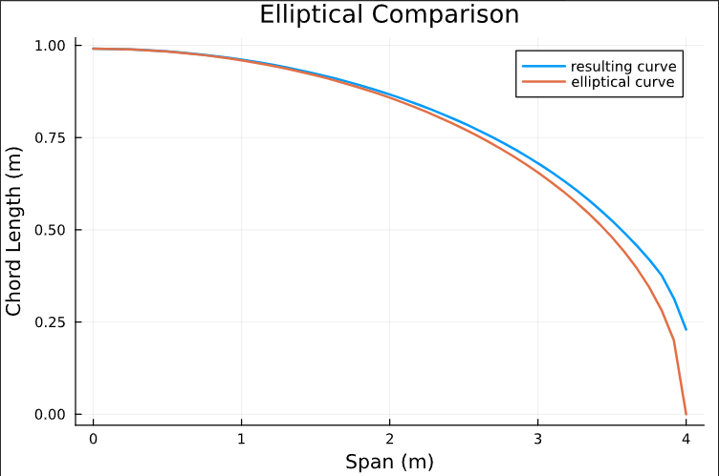
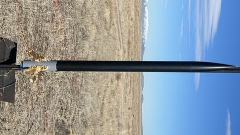

---
hide:
#   - navigation  
  - toc
---

# Project Portfolio

Welcome! This portfolio is a collection of projects I've poured my energy and passion into. The navigation on the left breaks my work down by category, or for a comprehensive summary, you can see everything at once in my [Complete Project Portfolio](./complete-project-portfolio.md).

* * *

## Highlighted Projects

The following featured projects are personal favorites and have contributed significantly to my learning and growth.

<!-- -   :material-quadcopter:{ .lg .middle } __3D Printed Quadrotors__

    ---

    Design and creation of multiple 3D printed quadrotors to fly in formation using ROS2

    { width= 100% }

    [:octicons-arrow-right-24: Learn more](projects/quadrotor.md) -->

-   :material-printer-3d:{ .lg .middle } __Computer Aided Design (CAD)__

    ---

    Use of engineering graphics to efficiently develop ideas into engineered designs

    { width= 100% }
    /// caption
    [:octicons-arrow-right-24: Learn more](projects/2025/cad.md)
    ///

-   :material-water:{ .lg .middle } __Rocket Water Ballast System__

    ---

    A post-apogee water ejection system for a high altitude rocket with hybrid motor

    { width= 100% }
    { width= 100% }
    /// caption
    [:octicons-arrow-right-24: Learn more](projects/2025/water-ballast.md)
    ///

-   :material-airplane:{ .lg .middle } __Aerodynamic Analysis & Optimization__

    ---

    Optimization of a wing airframe configuration using Julia packages

    { width= 100% }
    /// caption
    [:octicons-arrow-right-24: Learn more](projects/2024/aerodynamics.md)
    ///

-   :material-rocket:{ .lg .middle } __Rocket with H Level Motor__

    ---

    Launch and recovery of H impulse motor rocket to recieve level 1 certification

    { width= 100% }
    /// caption
    [:octicons-arrow-right-24: Learn more](projects/2024/H-rocket.md)
    ///
    

