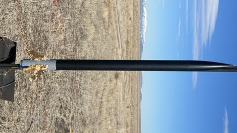

# Highlighted Projects

* * *

Welcome to my project portfolio. Enjoy exploring the various projects I have done. 

These projects are my favorites and have contributed significantly to my learning and growth.

-   :material-quadcopter:{ .lg .middle } __3D Printed Quadrotors__

    ---

    Design and creation of multiple 3D printed quadrotors to fly in formation using ROS2

    { width= 100% }

    [:octicons-arrow-right-24: Learn more](projects/quadrotor.md)

-   :material-printer-3d:{ .lg .middle } __Computer Aided Design (CAD)__

    ---

    Use of engineering graphics to efficiently develop ideas into engineered designs

    { width= 100% }

    [:octicons-arrow-right-24: Learn more](projects/cad.md)

-   :material-water:{ .lg .middle } __Rocket Water Ballast System__

    ---

    A post-apogee water ejection system for a high altitude rocket with hybrid motor

    { width= 100% }

    [:octicons-arrow-right-24: Learn more](projects/water-ballast.md)

-   :material-airplane:{ .lg .middle } __Aerodynamic Analysis & Optimization__

    ---

    Optimization of a wing airframe configuration using Julia packages

    { width= 100% }

    [:octicons-arrow-right-24: Learn more](projects/FLOW-lab.md)

-   :material-rocket:{ .lg .middle } __Rocket with H Level Motor__

    ---

    Launch and recovery of H impulse motor rocket to recieve level 1 certification

    { width= 100% }

    [:octicons-arrow-right-24: Learn more](projects/H-motor.md)

