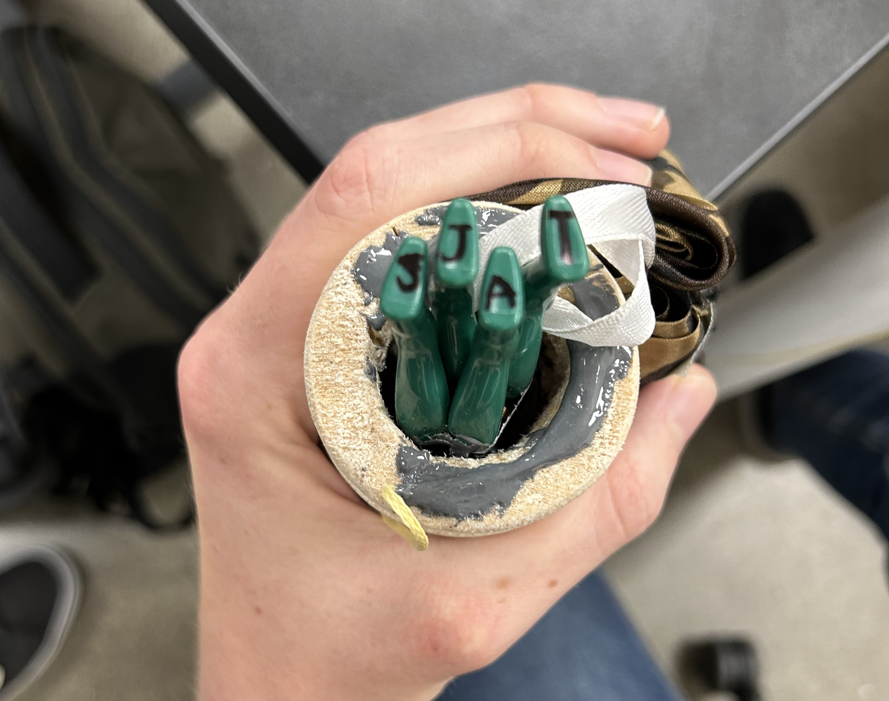
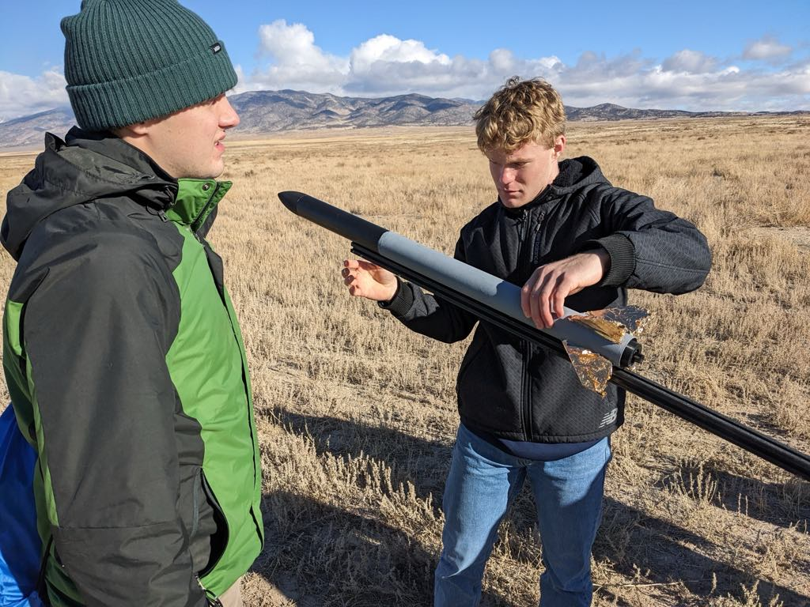
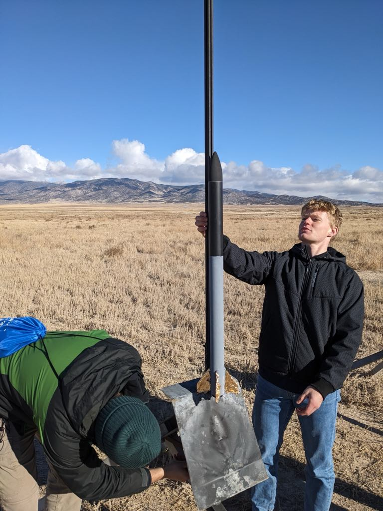
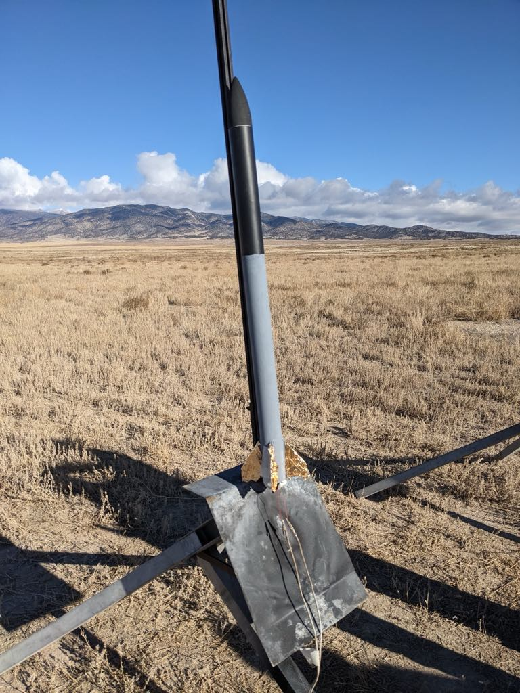
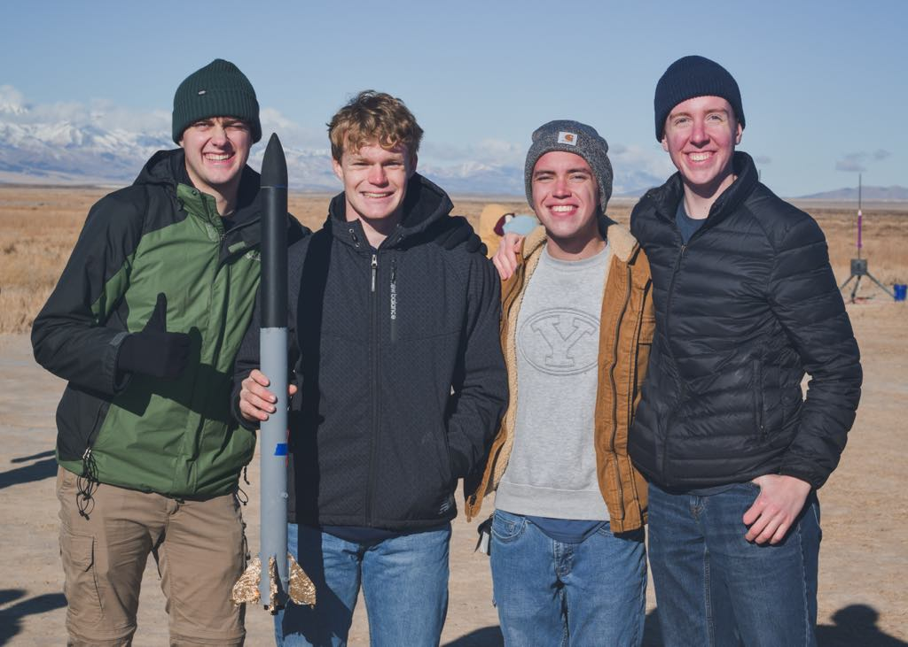
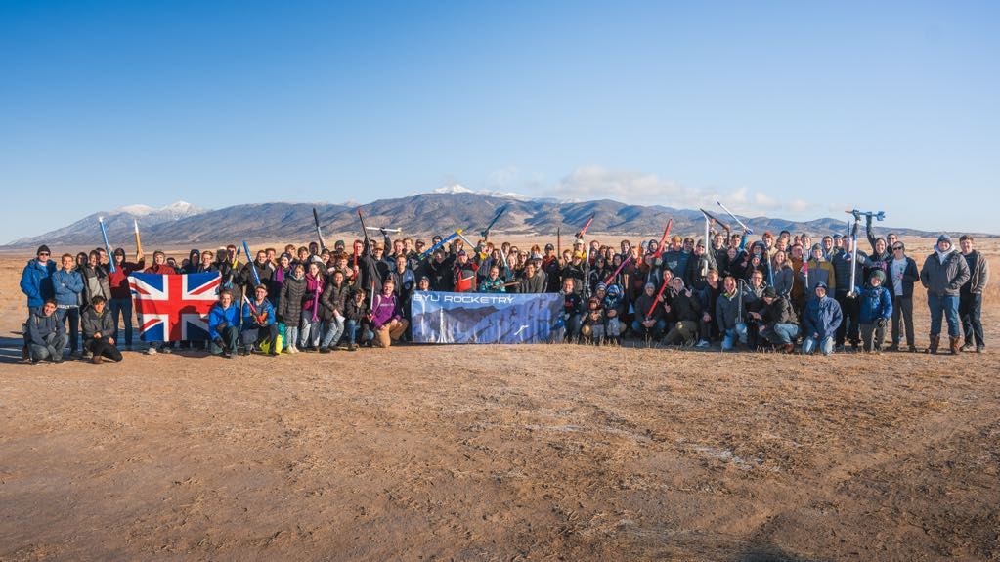

# Rocket with G Level Motor

## :material-notebook: Description

I successfully **designed, built, launched, and safely recovered** a rocket using a certifed motor in the **G impulse category**. I did this in a team with 3 others to compete in the [Student Launch Competition](https://rocketry.byu.edu/join-us/student-launch-comp/). Our target altitude was 1700 ft with a G74W commerical motor and we reached 1575 ft. 

!!! info

    I completed this project as a member of **[BYU Rocketry](https://rocketry.byu.edu/)**

***

## :material-key: Key Takeaways

- Reached an apogee of 1700ft
- Successfully built and recovered rocket without damage
- Passed a preliminary design review as well as a critical design review prior to launch

***

## :material-clock-time-five: Timeline

Duration: **September 2023 - December 2023**

Total time: **30 hours**

Time commitment: ~2 hours per week

***

## :material-presentation: Result

### Rocket name: [**The Elton John**](https://www.youtube.com/watch?v=DtVBCG6ThDk)

The unique aspect of this rocket is the four parachute army men we placed inside. Two in the nose cone (pictured below) and two in the parachute. We signed our initials on their feet and sent them off to launch.

{ width="100%" }
/// caption
Stuffing in the army men
///

{ width="75%" }
{ width="50%" }
/// caption
Loading the rocket onto the launch stand
///

{ width=500px }
/// caption
Rocket prepared for launch
///

{ width="100%" }
/// caption
Us with our rocket
///

{ width="100%" }
/// caption
BYU Rocketry Student Launch Competition 2023
///

### Videos

!!! success "Accomplishment"
    First rocket built and launched

<iframe width="462" height="822" src="https://www.youtube.com/embed/iuoT3lYNyi8" title="SLC 12/9/23" frameborder="0" allow="accelerometer; autoplay; clipboard-write; encrypted-media; gyroscope; picture-in-picture; web-share" referrerpolicy="strict-origin-when-cross-origin" allowfullscreen></iframe>
/// caption
The launch
///

<iframe width="660" height="415" src="https://www.youtube.com/embed/l1oW_qOQWYA?si=kpeVhzyg_8DuU3Yw" title="YouTube video player" frameborder="0" allow="accelerometer; autoplay; clipboard-write; encrypted-media; gyroscope; picture-in-picture; web-share" referrerpolicy="strict-origin-when-cross-origin" allowfullscreen></iframe>
/// caption
The landing
///

In the video you can see the two army men trailing behind the parachute line with their own seperate parachutes. They land together with the rocket close to the table. 

The other two army men were ejected with the parachute and descended completely seperate from the rocket. At the end of the video, you can see that I ran to go catch both of them out of the air as they descended. 

***

## :material-brain: Technical Skills

!!! tip "**Rocketry**"
    With no prior knowledge of rockets, I successfully learned all the basics to design, build, and launch my own rocket.

***
///caption
[:material-list-box: Return to project list](/project-portfolio/complete-project-portfolio/#__tabbed_1_2){ .md-button .md-button--primary }
///