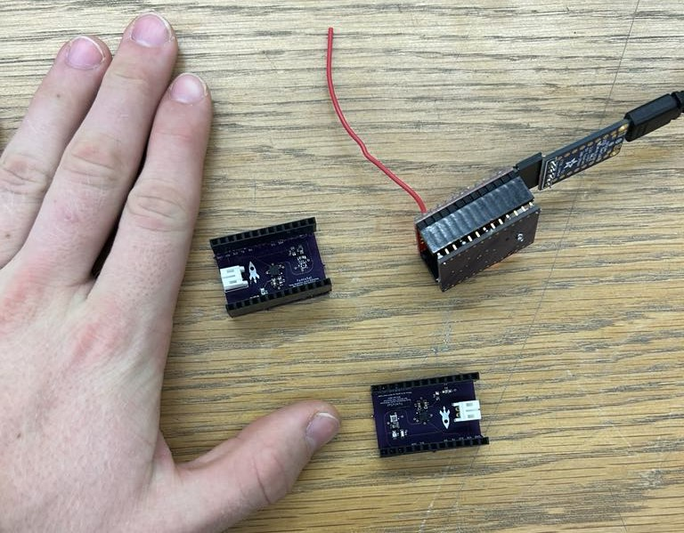
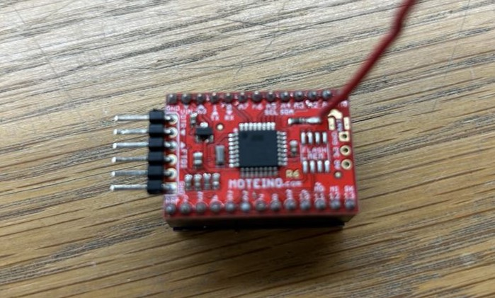

# FemtoSat

## :material-notebook: Description

I built a **small satellite** that transmitted data to the ground from a rocket 1,000 ft in the air. This was done as part of the [BYU Spacecraft club FemtoSat project](https://spacecraft.byu.edu/club/beginner/femtosat). The FemtoSat **transmitted altitude, velocity, air pressure, and other measurements** taken from it's environment. I completed this project in a team of four.

***

## :material-clock-time-five: Timeline

Duration: **September 2023 - December 2023**

Total time: **20 hours**

Time commitment: ~1 hour per week

***

## :material-presentation: Result

{ width="100%" }
/// caption
Our custom PCB
///

{ width="100%" }
/// caption
Size comparison of our PCB to a hand
///

{ width="100%" }
/// caption
The Moteino (a low power wireless Arduino)
///

{ width="100%" }
/// caption
The FemtoSat- our PCB and Moteino combined
///

{ width="100%" }
/// caption
Us with our FemtoSat in a mini-rocket
///

{ width="100%" }
/// caption
Setup with ground station receiver
///

<iframe width="660" height="415" src="https://www.youtube.com/embed/YSmnWVChJMg?si=lqy4in4H-aCL0kYT" title="YouTube video player" frameborder="0" allow="accelerometer; autoplay; clipboard-write; encrypted-media; gyroscope; picture-in-picture; web-share" referrerpolicy="strict-origin-when-cross-origin" allowfullscreen></iframe>
/// caption
Mini-rocket launch of our FemtoSat
///

***

## :material-brain: Technical Skills

!!! tip "**Electronics**"
    I learned how to solder and surface mount solder for the first time.