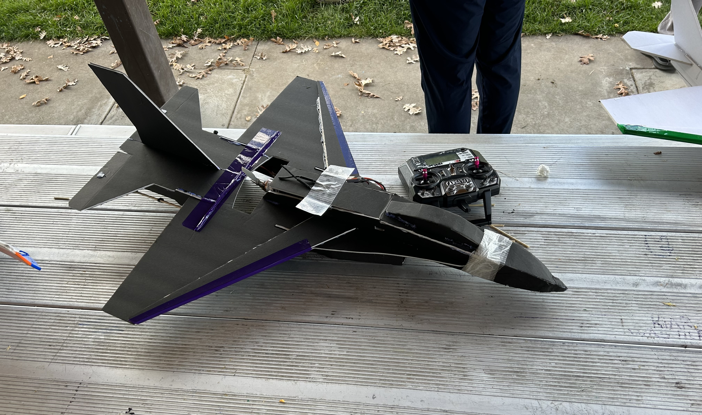
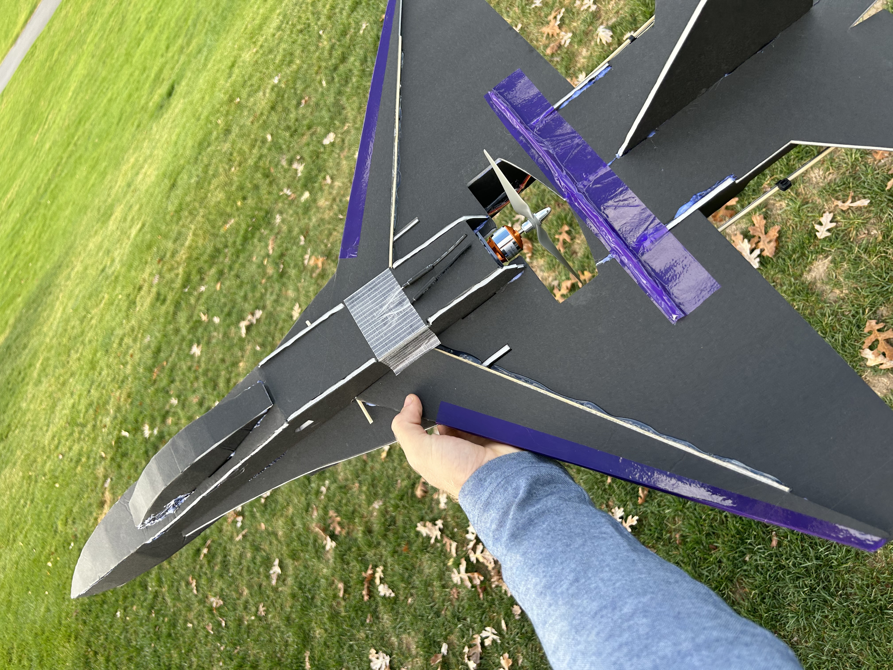
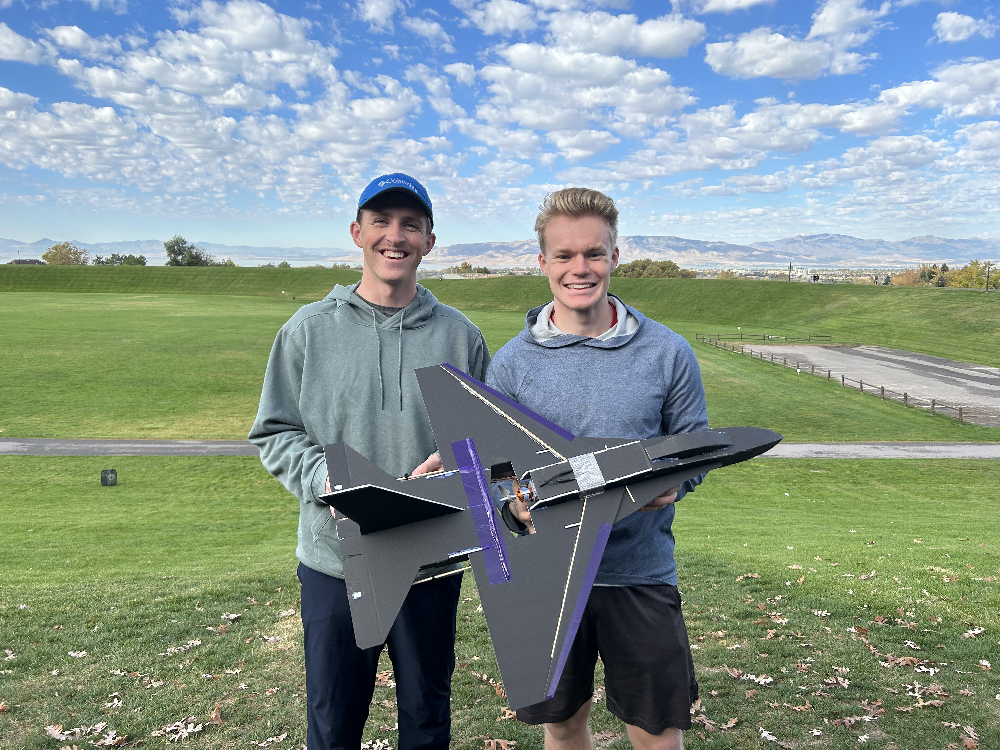
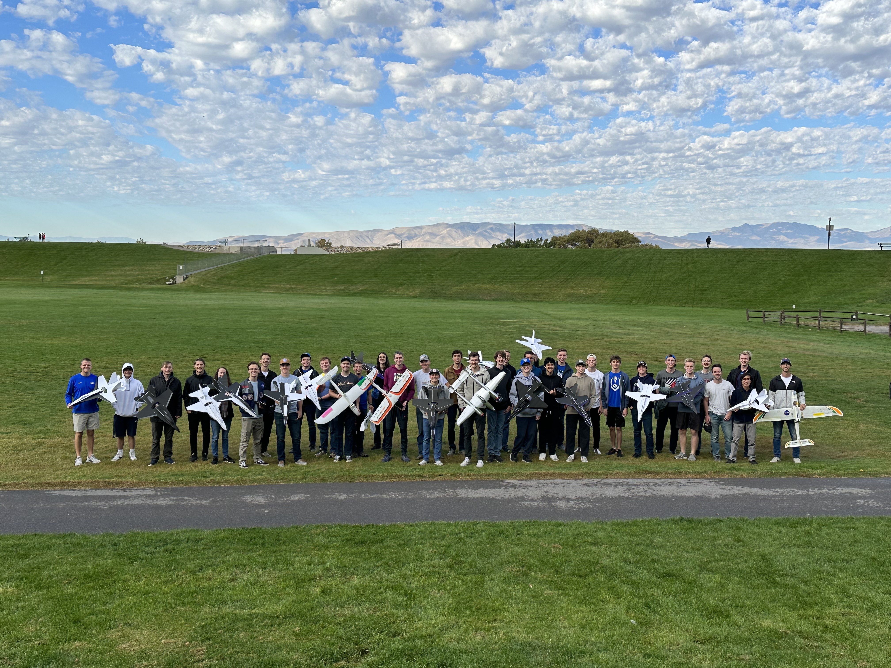

# RC Plane

## :material-notebook: Description

With a teamate, I reverse engineered a **foamboard F-16 profile jet**. I built and flew the plane as part of [BYU Aeronautics club - First Semester Planes](https://sites.google.com/view/byu-aeronautics/fixed-wing/first-semester-planes) experience.

***

## :material-clock-time-five: Timeline

Duration: **September 2023 - December 2023**

Total time: **20 hours**

Time commitment: ~1 hour per week

***

## :material-presentation: Result

{ width="100%" }
/// caption
The plane and transmitter
///

{ width="100%" }
/// caption
Up close view
///

{ width="100%" }
/// caption
My teamate and I on flight day
///

{ width="100%" }
/// caption
BYU Aeronautics Club
///

***

## :material-brain: Technical Skills

!!! tip "**Skill**"
    I learned basic aeronautics principles and how to build and fly a simple1 RC foamboard plane.