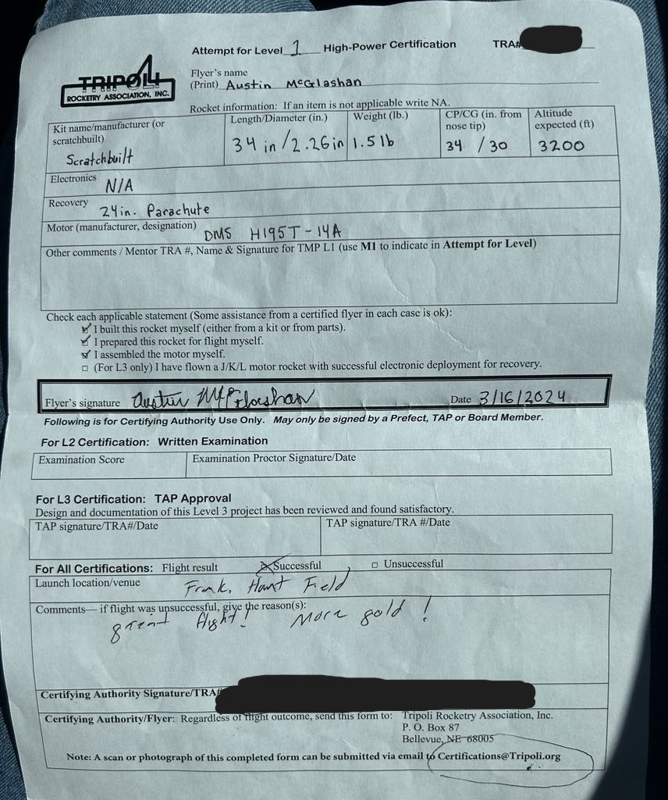

# Rocket with H Level Motor

## :material-notebook: Description

I successfully designed, built, launched, and safely recovered a rocket using a certifed motor in the H impulse category. In doing so, I recieved my Level 1 certification[^1]. I constructed this rocket by expanding upon skills and knowledge previously gained from building a simple rocket[^2] in a small team.

[^1]: Learn more about high power certification on the [TRIPOLI website](https://www.tripoli.org/content.aspx?page_id=22&club_id=795696&module_id=468541)
[^2]: [Rocket with G level motor](/project-portfolio/projects/2023/G-rocket.md)

!!! info

    I completed this personal project as a member of **[BYU Rocketry](https://rocketry.byu.edu/)**. I recieved my high power **[Level 1](https://www.tripoli.org/content.aspx?page_id=22&club_id=795696&module_id=468544)** rocketry certification from the **[TRIPOLI Rocketry Association](https://www.tripoli.org/)**.

***

## :material-target: Objectives

1. Obtain Level 1 rocketry certification

***

## :material-clock-time-five: Timeline

Duration: **January 2024 - April 2024**

Total time: **30 hours**

Time commitment: 2 hours a week for 15 weeks

***

## :material-presentation: Result

### Rocket name: **Goldilocks**

{ width="100%" }
/// caption
Rocket waiting for launch
///

{ width="100%" }
/// caption
Safe landing and recovery
///

{ width="100%" }
/// caption
Official L1 certification
///

### Videos

<iframe width="560" height="315" src="https://www.youtube.com/embed/LEaBT3fgHdg?si=cehpYZbjEgKE6S7O" title="YouTube video player" frameborder="0" allow="accelerometer; autoplay; clipboard-write; encrypted-media; gyroscope; picture-in-picture; web-share" referrerpolicy="strict-origin-when-cross-origin" allowfullscreen></iframe>
/// caption
Slow motion launch video
///

<iframe width="462" height="822" src="https://www.youtube.com/embed/xoYTLIH87pw" title="L1 Launch 3/16/24" frameborder="0" allow="accelerometer; autoplay; clipboard-write; encrypted-media; gyroscope; picture-in-picture; web-share" referrerpolicy="strict-origin-when-cross-origin" allowfullscreen></iframe>
/// caption
Launch video
///

!!! success "Accomplishment"
    I successfully built, launched, and recovered a H impulse motor rocket. I received my L1 certification :partying_face:
    
***

## :material-brain: Technical Skills

!!! tip "**Rocketry**"
    Strengthened my skills to design, build, and launch a rocket.