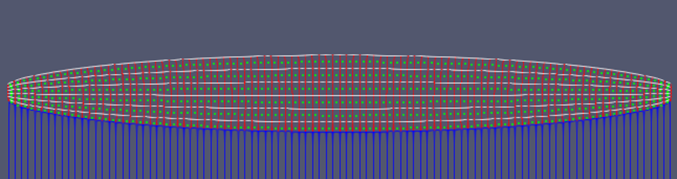

# Aerodynamic Analysis and Optimization

[:simple-github: Github Repository](https://github.com/austin006/497R-Airframe-Design){ .md-button .md-button--primary }

## :material-notebook: Description

This project consisted of **aerodynamic analysis** and **design optimization**, focusing on creating an optimal wing configuration for a simple airframe. Key characteristics such as chord and twist were optimized under specific conditions by leveraging the Julia packages **VortexLattice** for aerodynamic modeling and **SNOW** for its advanced nonlinear optimization and derivative computation capabilities.

!!! info "Info"

    I completed this project as an undergraduate researcher in the [BYU FLOW Lab](https://flow.byu.edu/) under the guidance of a graduate student mentor. This project is based upon the [Airframe Design Track](https://github.com/byuflowlab/undergrad-onboarding/blob/master/497R/track_descriptions/airframe_design.md).

***

## :material-target: Objectives

1. Airfoil analysis performed through computational fluid dynamics (CFD) simulations
2. Airframe analysis performed through the vortex lattice method (VLM)
3. Optimization of airframe aerodynamic design

***

## :material-clock-time-five: Timeline

Duration: **October 2023 - April 2024**

Total time: **80 hours**

Time commitment: 2-3 hours a week for 32 weeks.

***

## :material-presentation: Results

### Airfoil Analysis

<iframe src="/project-portfolio/projects/2024/assets/aerodynamics/Project1.pdf" width="100%" height="500px"></iframe>

### Airframe Analysis and Optimization

<iframe src="/project-portfolio/projects/2024/assets/aerodynamics/Project3.pdf" width="100%" height="500px"></iframe>

### Key Takeaways

{ width=500px }
/// caption
Explain image
///

{ width=500px }
/// caption
Explain image
///

!!! success "Elliptical Chord Distribution"
    I successfully implemented an optimization solver which converges to an elliptical wing chord distribution.

{ width=500px }
/// caption
Explain image
///

{ width=500px }
/// caption
Explain image
///

!!! success "Elliptical Twist Distribution"
    I successfully implemented an optimization solver which converges to a twisted wing with an elliptical lift distribution.

### Code

To see my code, check out my Github:

[:simple-github: Github Repository](https://github.com/austin006/497R-Airframe-Design){ .md-button .md-button--primary }

***

## :material-brain: Technical Skills

!!! tip "**Julia**"
    Leveraged the Julia programming language for high-performance technical computing, specifically to develop and execute complex nonlinear optimization algorithms for aerodynamic design projects. Julia excels in speed and performance, especially for numerical computing and high-performance scientific applictions.

!!! tip "**Aerodynamic Principles**"
    Learned the fundemental principles of flight and aerodynamics. Gained proficiency in modeling aerodynamic forces and performance characteristics of airfoils and airframes, using computational tools like VortexLattice to analyze and inform design decisions.

!!! tip "**Research Skills**"
    Exposed to university research and true independent problem solving. Demonstrated ability to independently gather, synthesize, and apply technical information from academic papers, documentation, and textbooks to solve a complex engineering problem.