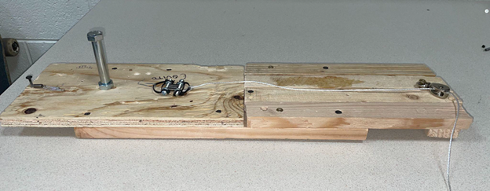
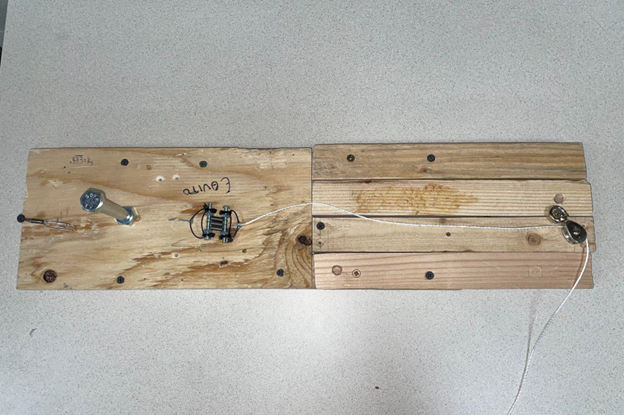
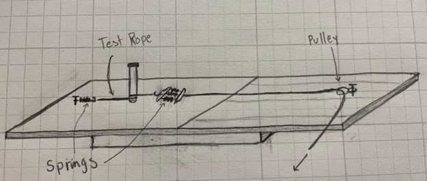
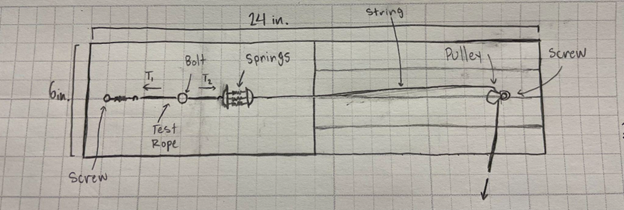

# Determining the Static Friction Coefficient Between a Rope and a Carabiner or Cylindrical Object

## :material-notebook: Description

**BYU ME EN 101 Design Project**. Team of 5 individuals.

In this project a simple device for a climbing equipment company will be created. The purpose
of this constructed device is to measure the static friction coefficient present between a rope and
a carabiner. The device will be able to measure variable-size diameter rope approximately 12
inches long with minimal human intervention. The expected capability is accurate measurements
for coefficients of friction between 0.03 and 0.4 around a ½ inch diameter steel bolt.

## :material-clock-time-five: Timeline

Duration: **April 2024**

Total time: **15 hours**

***

## :material-presentation: Result

The design approach is to determine the ratio of tensions of each side of the rope at the moment
the rope slips on the cylinder, from which, the static coefficient can be computed. Our method
consists of using fixed springs attached to both sides of the rope which is wrapped around the
cylinder. The displacement of these springs correlates to the amount of force produced by them,
which, due to simple force analysis at static equilibrium, corresponds with the amount of tension
in the rope. 

The implemented design assumes that for every measurement one spring is stretched
the same amount, therefore a constant value of tension force on one side of the rope is
maintained. Hence, only one tension force needs to be observed by the user, acquired by
measuring the displacement of the springs hooked to the opposite side of the rope at the moment
it slips about the steel bolt. 

In effort to increase ease of use and simplicity of the device, this
displacement will be measured using a meter already displaying the static coefficient of friction,
previously calculated according to the equivalent length of spring displacement.

{ width="100%" }
/// caption
The friction coefficient measurement device
///

{ width="100%" }
/// caption
Top view
///

{ width="100%" }
/// caption
General concept and drawing of the designed instrument
///

{ width="100%" }
/// caption
More detailed concept and drawing of the designed instrument
///

***