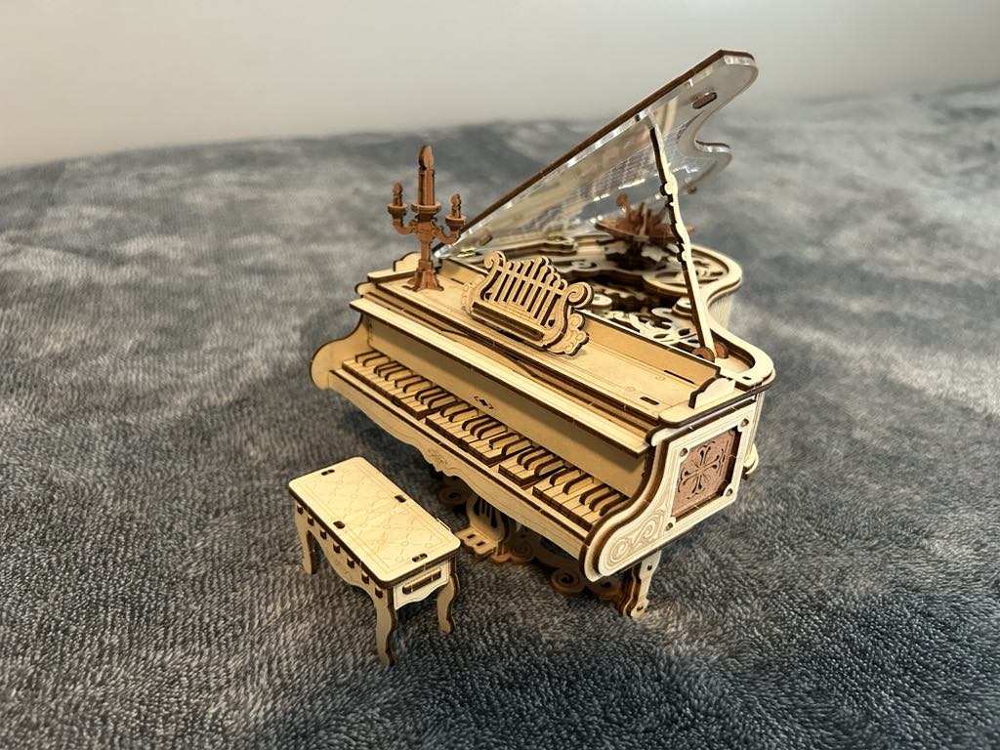
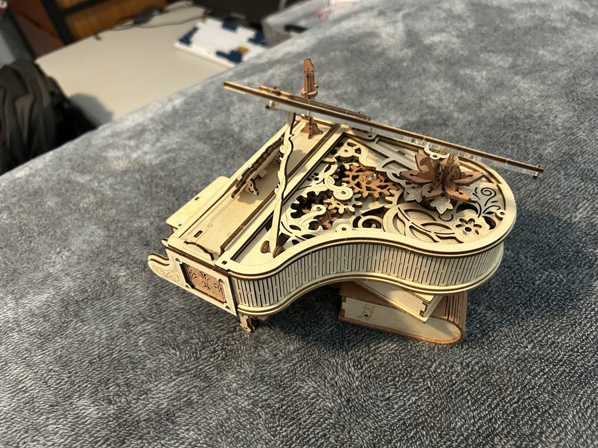

# Gear Motion Physical Model

## :material-notebook: Description

BYU ME EN 204: Dynamics Physical-Hardware Model Project

Assignment: Build a model incorporating 4-bars and/or **gears**.

I used a [ROKR Magic Piano Music Box](https://www.amazon.com/ROKR-3D-Puzzles-Adults-Building/dp/B0C7KR7PGL/ref=sr_1_2_sspa?crid=1HINSLQYJN63M&dib=eyJ2IjoiMSJ9.qFGqIawgEkMPiZesbgn8nBioGnMXt8SOJ03TJXYI9NWIcwWR8ZIpaxPyz6mL0TowHPXz0uLQYvmB6-_cyA-0WKP17V8ipIjpNWVBzg3xaKC3KjDaMUEhuRuXbj03d7q2cepVaeUsUm9d8DQUV8CLXcjiZRcIOdS8p0V6CSddvF32wFZZJ3CUkMsMGtKOgZTc49ueKA8LG7-nsrANOEVy-RRazOxZni-ZjGhoD5xAgGmD8I2L3I6Ilz1yUO03JDmflp3hUNBSQT3fYjiQwPSa6PMkwRzhn6_O1Hxi9g2dgtI.u5M11adWO2aB9sULb9M06hNFlBtut_LWFjXIO5jKAp0&dib_tag=se&keywords=wooden%2Bgear%2Bpiano&qid=1749998368&s=toys-and-games&sprefix=wooden%2Bgear%2Bpiano%2Ctoys-and-games%2C117&sr=1-2-spons&sp_csd=d2lkZ2V0TmFtZT1zcF9hdGY&th=1)

***

## :material-clock-time-five: Timeline

Duration: **December 2024**

Total time: **5 hours**

***

## :material-presentation: Result

Final product took me 5 hours to assemble and had a functional music box and gears: 

{ width="49%" }
{ width="49%" }

<iframe width="560" height="315" src="https://www.youtube.com/embed/KMZZUUxaWYE?si=eP0KX6GRR9IzTqtH" title="YouTube video player" frameborder="0" allow="accelerometer; autoplay; clipboard-write; encrypted-media; gyroscope; picture-in-picture; web-share" referrerpolicy="strict-origin-when-cross-origin" allowfullscreen></iframe>
/// caption
ROKR demonstration of the puzzle's gears
///

***
///caption
[:material-list-box: Return to project list](/project-portfolio/complete-project-portfolio/#__tabbed_1_2){ .md-button .md-button--primary }
///