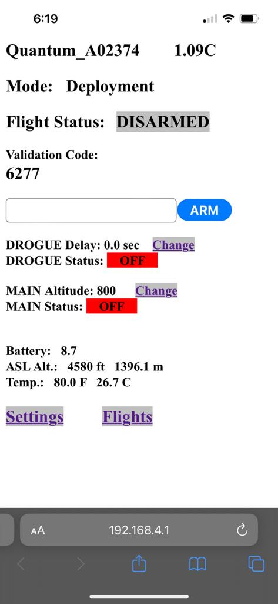

# Rocket Payload Electronics

[:simple-github: Github Repository](https://github.com/scortch445/alc2024.git){ .md-button .md-button--primary }

## :material-notebook: Description

As a member of [BYU Spacecraft club](https://spacecraft.byu.edu/), I worked closely with a BYU Rocketry team to design a payload for their rocket. As one of 5 members on the payload team, I contributed by **setting up an altimeter** and connecting it with other components in the system. A big accomplishment was sending a **camera in our payload** to record in-flight footage.

***

## :material-clock-time-five: Timeline

Duration: **January 2024 - April 2024**

Total time: **35 hours**

Time commitment: ~2 hours per week

***

## :material-presentation: Result

{ width=300px }
/// caption
Altimeter user interface page
///

{ width="100%" }
/// caption
Connection between altimeter and battery
///

{ width=400px }
{ width=400px }
/// caption
Working in the spacecraft lab
///

{ width=300px }
/// caption
Launch day with rocketry team
///

!!! success "Accomplishment"
    Launch day resulted in a successful flight and recovery.

***

## :material-brain: Technical Skills

!!! tip "**Electronics**"
    First time soldering an altimeter together and connecting many electrical components in a system.

***
///caption
[:material-list-box: Return to project list](/project-portfolio/complete-project-portfolio/#__tabbed_1_2){ .md-button .md-button--primary }
///