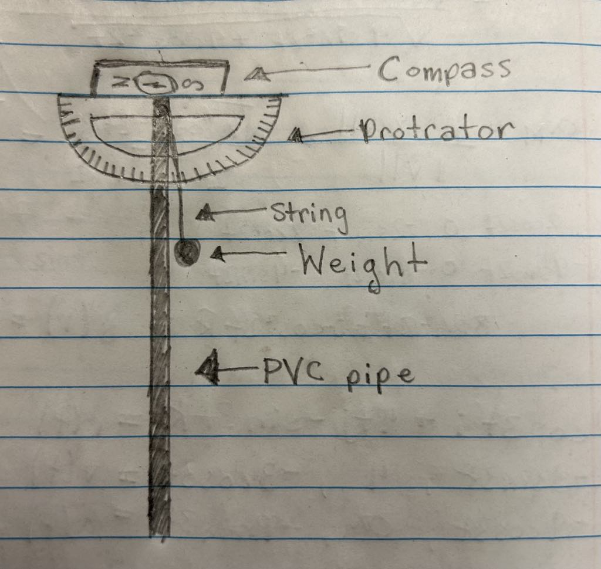
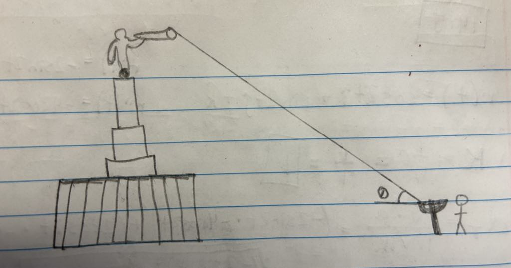
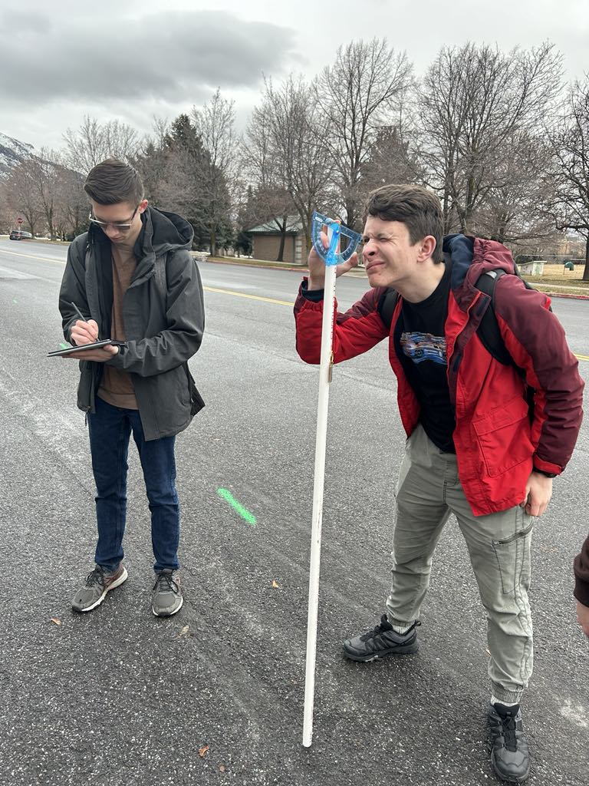
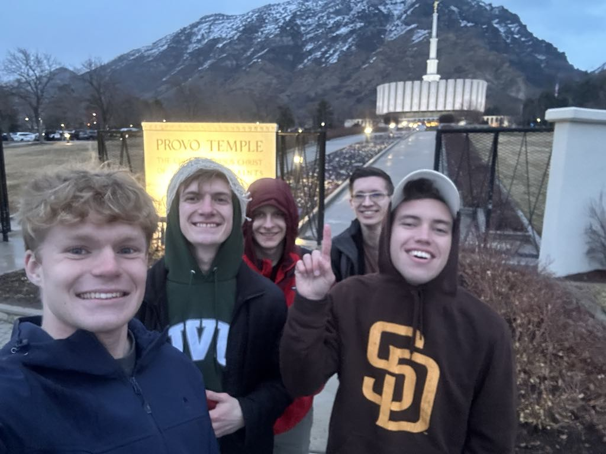
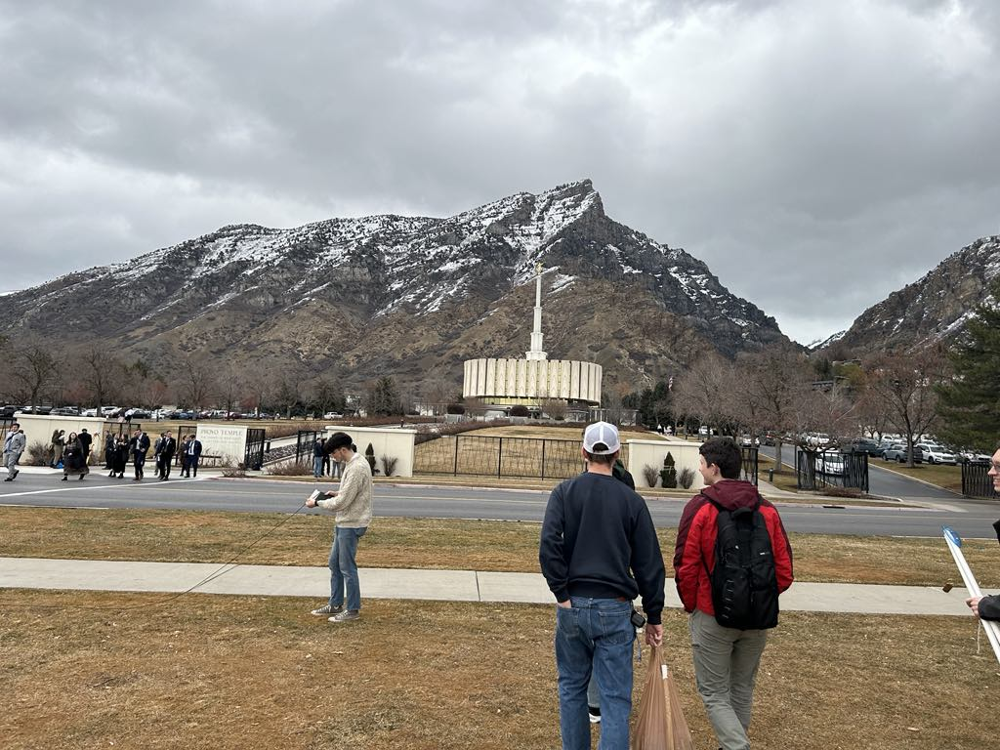

# Determining the Height of the Provo Temple with Respect to the West Gate

## :material-notebook: Description

**BYU ME EN 101 Design Project**. The purpose of our design is to measure the height of the Provo Temple (including the angel
Moroni statue) with respect to the west gate. Our method consists of establishing a coordinate
system with three specified points. The points being: the top of the angel Moroni statue, the west
gate of the temple, and a third location approximately 200 ft from the west gate. After
constructing a coordinate system, we will define three vectors by connecting the chosen points.
By measuring all the angles between these vectors from the two ground points, we will be able to
conduct an analysis using vector addition in 3-dimensions to find the height of the Provo Temple.

***

## :material-clock-time-five: Timeline

Duration: **Feburary 2024**

Total time: **15 hours**

***

## :material-presentation: Result

In order to determine the cosine angles of the vectors, we have designed an instrument that will
measure the angles between vectors, which can then be converted to cosine angles. The
instrument consists of two PVC pipes of equal length, a protractor, a small weight, and a
compass. The weight hangs from a thread mounted at the top of the PVC pipe in order to ensure
it is always level with the ground. Angles between vectors can then be obtained by the compass
and protractor mounted at the top of the pipe. Consequently, the instrument reads horizontal and
vertical directions relative to a cardinal direction or level surface. This will provide sufficient
information for calculation of the cosine angles.

{ width=400px }
{ width=400px }
/// caption
General concept and drawing of the designed instrument.
///

{ width=300px }
/// caption
Instrument is being used to measure the
angle between the ground (xy plane) and the temple
///

{ width="49%" }
{ width="49%" }

Using a vector addition approach we determined the height of the Provo temple with respect to the west gate to be 206 ft. This is somewhat accurate, although we don't have the exact values to compare against, the height of the temple itself is 175 ft and the distance from the temple base to the gate is around 50 ft.

***

## :material-brain: Technical Skills

!!! tip "**Engineering Desgin**"
    Using household materials and knowledge of vector addition and triangulation, we were able to create a tool to measure the height of a tall building in short amount of time.