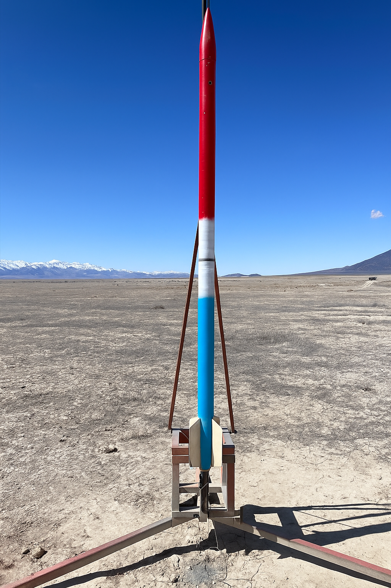

# L Level Rocket - Advanced Launch Competition

## :material-notebook: Description

I helped build this rocket in a team of 5. We flew it with a massive **L1000 motor**. The rocket was just under **7ft tall**, flew **Mach 1.465** during launch, and reached an apogee of **~8,000ft**.

Our purpose was to compete in the [Advanced Launch Competition](https://rocketry.byu.edu/join-us/advanced-student-launch-comp/) (ALC) with goal to hit a target altitude of 5,000ft (almost 1 mile).

***

## :material-key: Key Takeaways

- Learned how to build a dual-deployment high power rocket
- Collaborated with [BYU Spacecraft](https://spacecraft.byu.edu/club/) to carry a payload with camera

***

## :material-clock-time-five: Timeline

Duration: **Jan 2025 - Apr 2025**

Total time: **20 hours**

Time commitment: ~1 hour per week

***

## :material-presentation: Result

/// caption
Rocket name: **Rocket Pop**
///

<iframe width="462" height="822" src="https://www.youtube.com/embed/InNFZMED6xY" title="ALC 4/5/25" frameborder="0" allow="accelerometer; autoplay; clipboard-write; encrypted-media; gyroscope; picture-in-picture; web-share" referrerpolicy="strict-origin-when-cross-origin" allowfullscreen></iframe>
/// caption
Launch video
///

<iframe width="1869" height="749" src="https://www.youtube.com/embed/xGip8ULS-O8" title="ALC 4/5/25" frameborder="0" allow="accelerometer; autoplay; clipboard-write; encrypted-media; gyroscope; picture-in-picture; web-share" referrerpolicy="strict-origin-when-cross-origin" allowfullscreen></iframe>
/// caption
Payload camera footage
///

***

## :material-brain: Technical Skills

!!! tip "**Rocketry**"
    Deepened my rocketry knowledge by constructing a high power rocket. Learned how to do dual-deployment. Empowered me with the skills to try obtaining my L2 certification.

***
///caption
[:material-list-box: Return to project list](/project-portfolio/complete-project-portfolio/#__tabbed_1_2){ .md-button .md-button--primary }
///