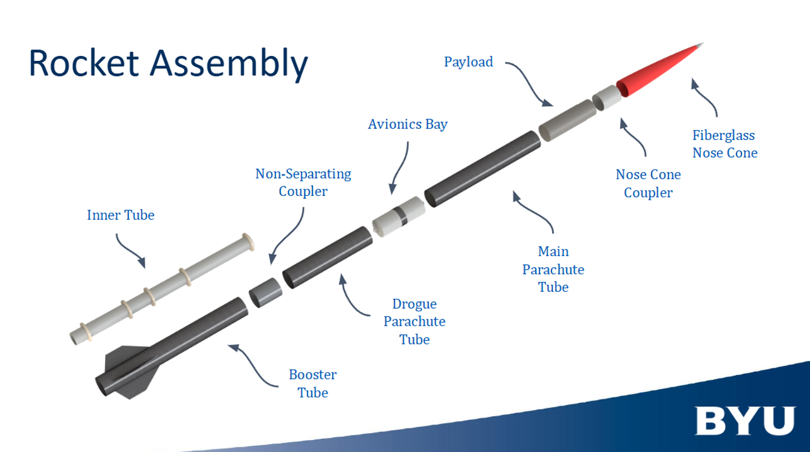
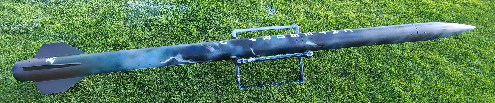

# Rocket Water Ballast System

## :material-notebook: Description

I followed a complete engineering design process to create a functioning water ejection system for a high altitude rocket. **This system ejects 2 kg of water in 90 seconds from a 6 in diameter rocket during the post-apogee descent.** I was one of four payload engineers on the [Experimental High Power Team](https://rocketry.byu.edu/junior-high-power-team). Aside from my payload responsibilities, I also helped with the overall creation, coordination, and launch of the rocket. 

This was the first time BYU Rocketry launched with a hybrid motor - we made [the news](https://www.ksl.com/article/51303782/byu-rocketry-club-reaches-new-heights-with-historic-launch-recovery-of-hybrid-rocket)!

***

## :material-target: Objectives

1. Successfully launch and recover BYU's first hybrid rocket and first water ballast system

2. Compete in California's [FAR-OUT](https://www.faroutlaunch.org/) 2025 competition

3. Use a custom launch trailer designed by senior engineering students

***

## :material-clock-time-five: Timeline

Duration: **September 2024 - April 2025**

Total time: **50 hours**

Time commitment: 1-2 hours a week for 32 weeks

***

## :material-presentation: Result

### Preparation & Design

In two technical design presentations (PDR and CDR) our rocket and payload designs were itteratively improved upon before construction began.

{ width="100%" }
/// caption
The Experimental High Power Team of 2024-2025 
///

{ width="100%" }
/// caption
Overview of rocket internals
///

{ width="100%" }
/// caption
Design and anaylsis of rocket in [OpenRocket](https://openrocket.info/)
///

Our intial design had a container of water which was pressurized by a motor-plunger system, causing ejection of the contained water.

{ width=300px }
/// caption
CAD model of water ejection system
///

### Videos

Here are two videos from our successful test launch 

!!! success "Accomplishment"
    This was the first Utah student-made hybrid rocket launch and recovery and a [news article](https://www.ksl.com/article/51303782/byu-rocketry-club-reaches-new-heights-with-historic-launch-recovery-of-hybrid-rocket) was made about this.

<iframe width="462" height="822" src="https://www.youtube.com/embed/lLpFiryUqTQ" title="EHPT 4/5/25" frameborder="0" allow="accelerometer; autoplay; clipboard-write; encrypted-media; gyroscope; picture-in-picture; web-share" referrerpolicy="strict-origin-when-cross-origin" allowfullscreen></iframe>
/// caption
Close-up view of launch
///

<iframe width="462" height="822" src="https://www.youtube.com/embed/VkSoiQ7n1To" title="EHPT 4/5/25" frameborder="0" allow="accelerometer; autoplay; clipboard-write; encrypted-media; gyroscope; picture-in-picture; web-share" referrerpolicy="strict-origin-when-cross-origin" allowfullscreen></iframe>
/// caption
Rocket achieved apogee of ~6,000 ft 
///

### Final Product

The final design consisted of three parts when taken out of the rocket.

{ width="100%" }
/// caption
Complete water ballast system
/// 

Description of each component from left to right: 

- Water bag - flexible, compact storage of up to 3 kg of water
- Top bulkhead fitted with a solenoid - allows for complete control of water valve
- Plunger and bottom bulkhead attached with motor, batter, and electronics

Essentially the water bag is sandwiched between the two bulkheads inside the rocket. The motor is activated during post-apogee descent by an altimeter and begins to extend the plunger. The plunger squeezes the bag and the water exits through the solenoid and tubing to leave the rocket.

{ width=300px }
/// caption 
Top view of water ballast system
///

I assisted in the production process of creating our carbon fiber rocket tubes. The following pictures depict the fully assembled and decorated rocket.

{ width="100%" }
{ width="100%" }
///caption
Rocket name: **CATEGORY V**
///

***

## :material-brain: Technical Skills

!!! tip "**Engineering Design**"
    Learned how to pioneer a new system through iterative design and testing.

!!! tip "**Manufacturing**"
    Learned how to manufacture and fabricate various parts and components using various tools. Examples: custom parts with 3D printing, carbon fiber, crimping and soldering, use of lathes and mills, and more.
