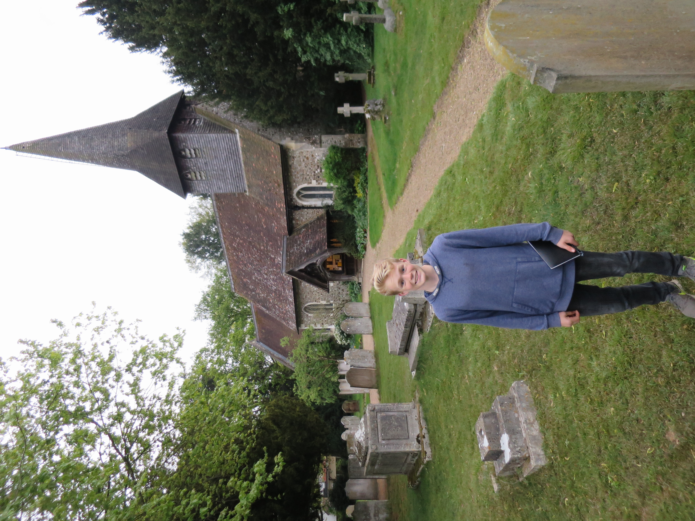

# Eagle Scout Project - Grave Indexing

## :material-notebook: Description

For my Eagle Scout project, I helped St. Mary's church in England record gravestone information. We were able to create **paper and digital records** (with pictures) for over **500 graves** which had previously been unrecorded. This information was published online to become searchable for those performing family history work. 

***

## :material-clock-time-five: Timeline

Duration: **April 2017**

Total time: **129 hours** (given by myself and all those involved in the project)

***

## :material-presentation: Result

{ width="100%" }
/// caption
St. Mary's Church
///

{ width="100%" }
/// caption
Hundreds of unrecorded gravestones
///

{ width="100%" }
/// caption
Recording the gravestone information by hand
///

{ width="100%" }
/// caption
Digitizing the gravestone information
///

***
///caption
[:material-list-box: Return to project list](/project-portfolio/complete-project-portfolio/#__tabbed_1_2){ .md-button .md-button--primary }
///