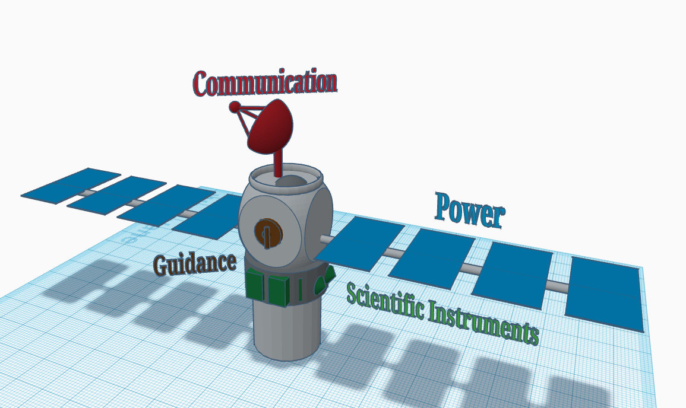

# NASA Engineering Challenge

## :material-notebook: Description

I participated in NASA's [High School Aerospace Scholars](https://www.nasa.gov/learning-resources/high-school-aerospace-scholars/) program, a **STEM learning experience** to engage with NASA's missions. I was able to interact with and learn from **NASA scientists, engineers, and astronauts**. I completed a five-month online learning experience and then a five-day virtual summer camp. Sadly, due to COVID-19, I was unable to attend a residential experience at NASA's Johnson Space Center.

***

## :material-clock-time-five: Timeline

Duration: **October 2019 - April 2020**

Total time: **30 hours**

***

## :material-presentation: Result

{ width="100%" }
/// caption
Example design work from the project
///

***