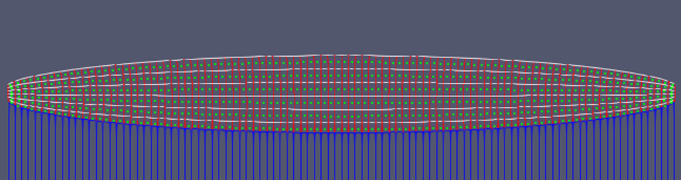

# Title

[:simple-github: Github Repository](#){ .md-button .md-button--primary }

## :material-notebook: Description

Insert description.

!!! info "Highlight"

    Any specific information or notes about project. Something that stands out.

***

## :material-target: Objectives

1. Objective 1
2. Objective 2
3. Objective 3

***

## :material-clock-time-five: Timeline

Duration: **dates**

Total time: **## hours**

Time commitment: context of time spent

***

## :material-presentation: Result

Presentation of the project

**Don't forget pictures**

{ width=300px }
{ width=300px }

{ width=300px }
{ width=300px }

!!! success "Accomplishment"
    Wow I did something

***

## :material-brain: Technical Skills

!!! tip "**Skill**"
    description

!!! tip "**Skill**"
    description